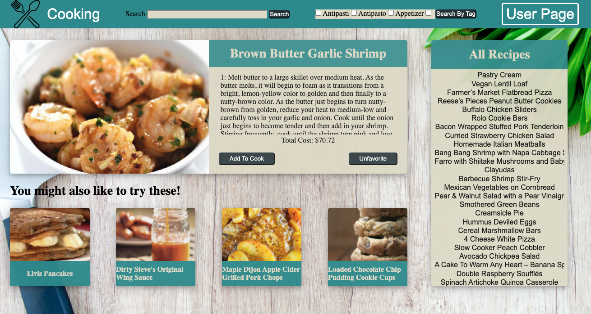
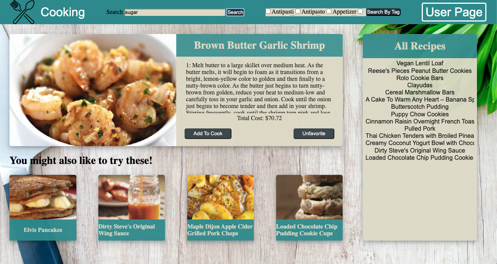
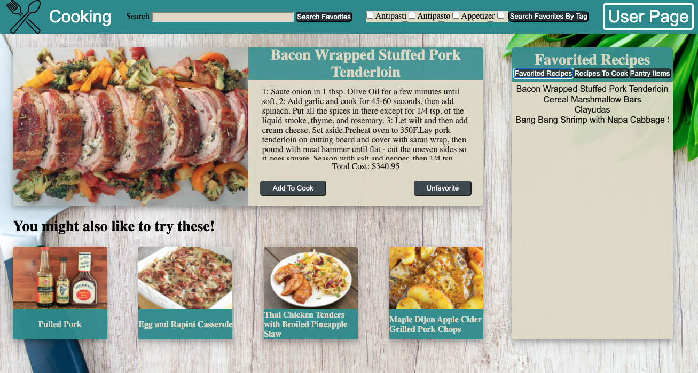
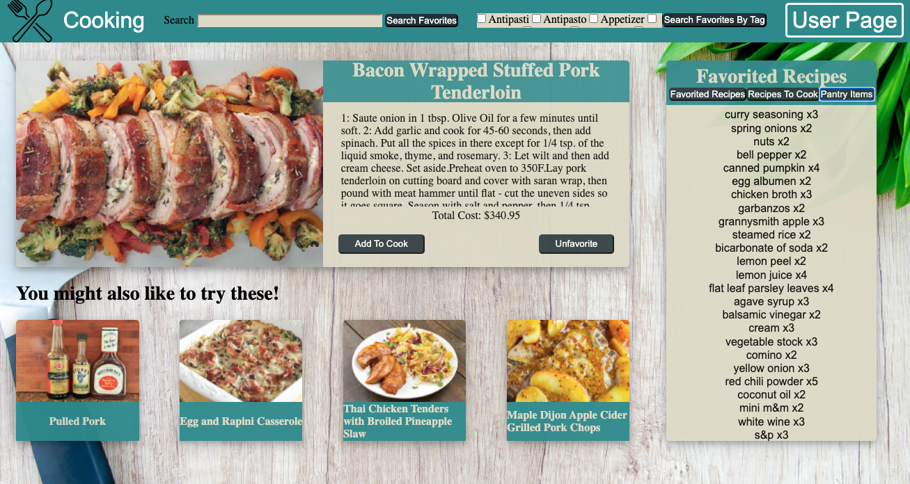
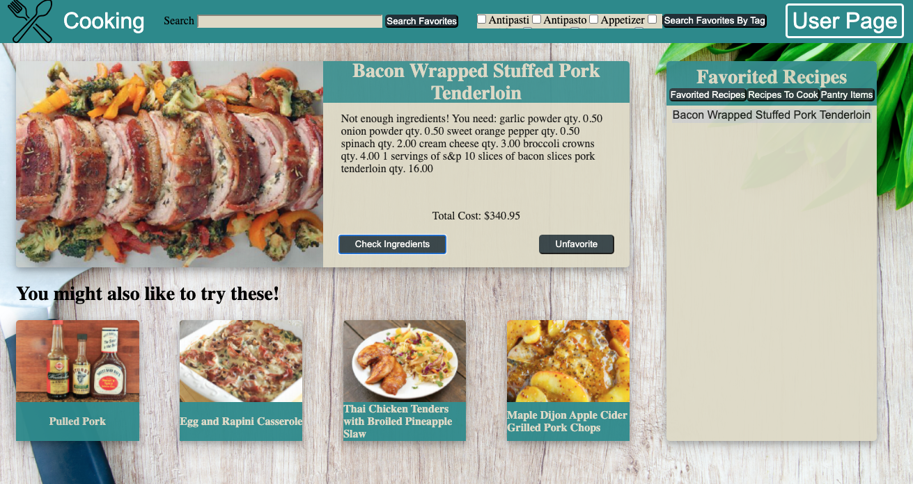
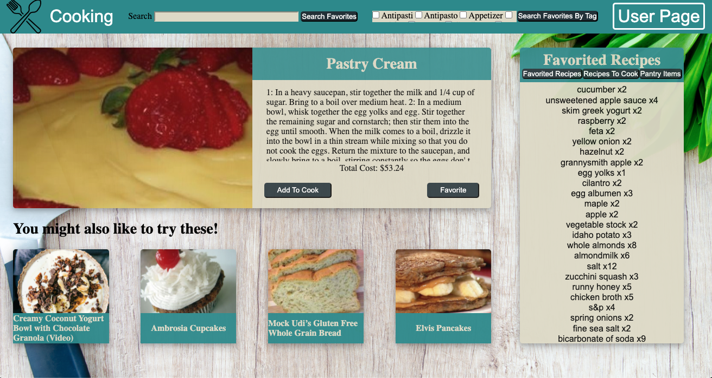
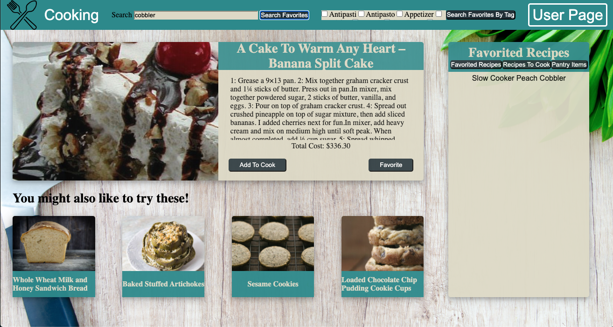

# What's Cookin?

## Overview

What's Cookin was a paired project 8 weeks into Turing to practice dealing with and iterating through larger datasets, implimenting testing and creating responsive design. 
#### A application for Recipe/Meal planning

  * Work on this project has slowed or stopped completely. Deadline 2/17/2021 9pm MST.*

## Learning Goals

  * Utilize the git workflow when not pairing.
  * Use ES6 syntax to create and interact with JavaScript classes.
  * Practice using object and array prototype methods to manipulate data.
  * Implement responsive layouts
  * Create a robust testing suite using TDD

## Set-up
  * Create repository and clone to personal computer
  * Run ```npm install```
  * Open in text editor
  * Read the README.md
  * In terminal, run command "open index.html" to interact with the application.

## Contributors

  * [Paige Vannelli](https://github.com/PaigeVannelli)
  * [Aaron Foucheaux](https://github.com/Afoucheaux)


## Functionality Goals

* Create meal planning application. This utilized a provided data set to create a user experience that allowed for. Searching recipes in multiple ways. Having a client be able to favorite recipes and save them to cook. It allows for them to utilize their pantry to check if meals are cookable. Return an updated pantry or a list of missing items.

## Road Map

* Dynamic Search Functionality.
* Upgraded responsive layouts
* 3rd use of libraries to add a glide display and upgrade to the search by tags.
* Added in additional client functionality for rating recipes and generating recommendations.   
* Consider user experience and sit with the app and look for ways to make the experience more pleasurable and accessible.

## Functionality

Upon opening the website, the user should be able to view all recipes on the recipe selector sidebar. When the user clicks on a recipe, that recipe is diaplyed on the main card and includes cooking instructions, cost and options to favorite/ unfavorite, and add to recipes to cook. 

<p align='left'>Main Page</br>

</p>

A user can also search by name or ingredients in the search bar or filter through recipes using one or multiple tags.

<p align='left'>Search All Recipes</br>

</p>

When clicking on the user page, the user will be able to view all of their favorited recipes, recipes to cook and pantry items. 

<p align='left'>View Favorited Recipes</br>

</p>

<p align='left'>View Pantry Items</br>

</p>

When the user clicks on a recipe the recipe card will display an option to either cook the recipe or check ingredients. If the user has enough ingredients, they should be able to cook a recipe and the recipes ingredients will be removed from their pantry. If the user does not have enough ingredients a messgae will display telling the user what they are missing. 

<p align='left'>Display Ingredients Needed</br>

</p>

<p align='left'>Cook Recipe</br>

</p>


A user can also search through their favorited recipes by name or ingredient using the search bar. A user can also search through favorited recipes by tags.

<p align='left'>Search Favorited Recipes</br>

</p>

## Future Iterations

 * Impliment a third party library Micromodal (https://www.npmjs.com/package/micromodal) to clear up search bar functionality and design. 
 * Past Recipe ratings. User can rate recipes they've cooked and view past ratings.
